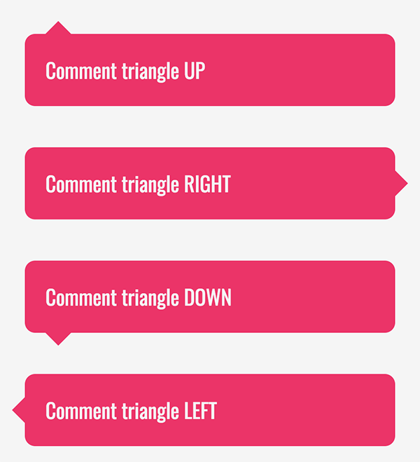
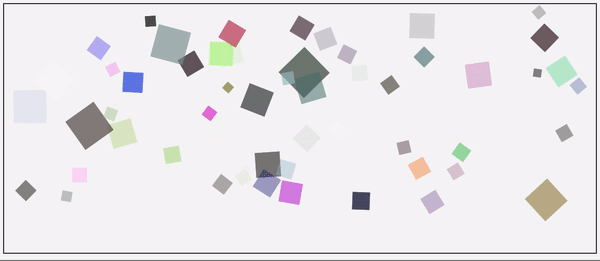

# Crear triángulos
A partir de una lista dada, crea un modificador de la clase `.triangle` que sirva para crear triángulos utilizando un pseudo elemento como se ve en la imagen



- Utiliza la directiva `@while` para recorrer la lista
- Utiliza un `%placeholder` para generar menos código CSS resultante

```SCSS
    $triangles: 'up', 'right', 'down', 'left';
```

En este ejercicio aplicaremos:

- Bucles
- Listas
- `%placeholder`
- `@mixin`
- Condicionales
- Interpolación

---

# Animaciones aleatorias
Pinta 60 elementos HTML con esas características:

- Tamaños aletarios entre 20 y 30px (que sean cuadrados)
- Cada uno tendrá un color aleatorio
- Opacidades aleatorias
- Distribución aleatoria de los elementos (usando `top` y `left`)
- La propiedad `z-index` de cada elemento ha de ser mayor que el del elemento anterior
- Genera una animación específica para cada elemento
- La duración será aleatoria entre 2000 - 3500ms (`animation-duration`)
- El tiempo de espera ha de ser aleatorio entre 100 - 300ms  (`animation-delay`)
- La rotatión y escalado serán aleatorias tanto para el punto inicial como para el final
- Los elementos impares tendrán una rotación negativa en el inicio



Puedes utilizar esta función para generar colores aletatorios
```SCSS
    @function randomColour() {
        @return hsl(random(360), random(100)*1%, random(100)*1%);
    }
```

En este ejercicio haremos uso de:

- Bucles
- Condicionales
- Interpolación
- Funciones propias
- Función `random()`
